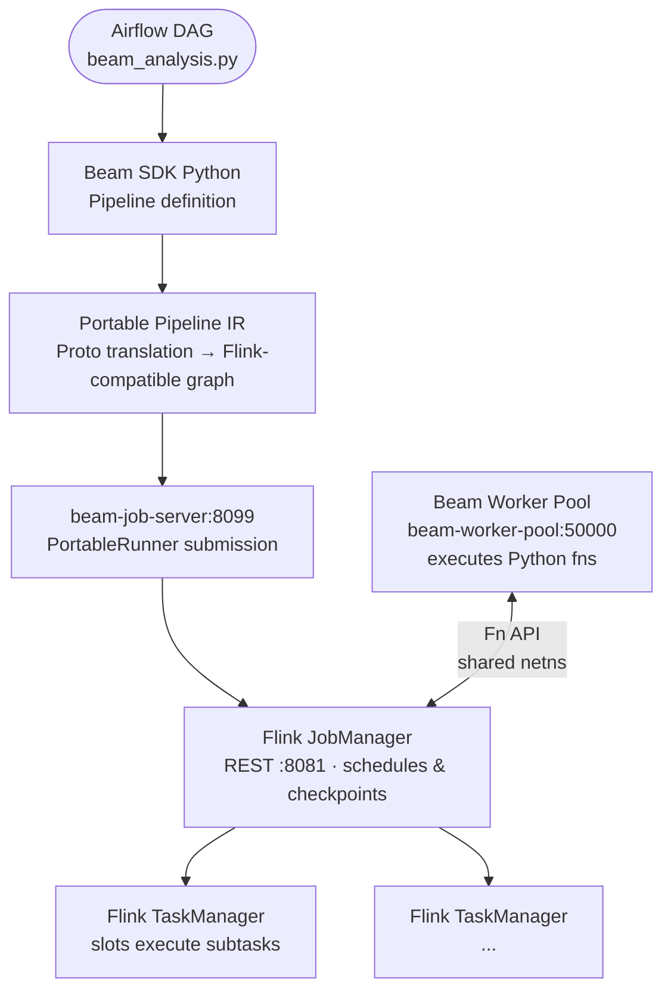
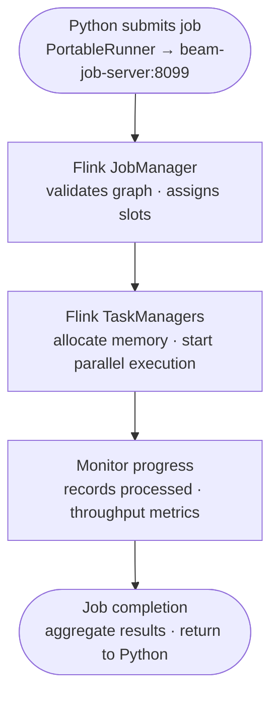
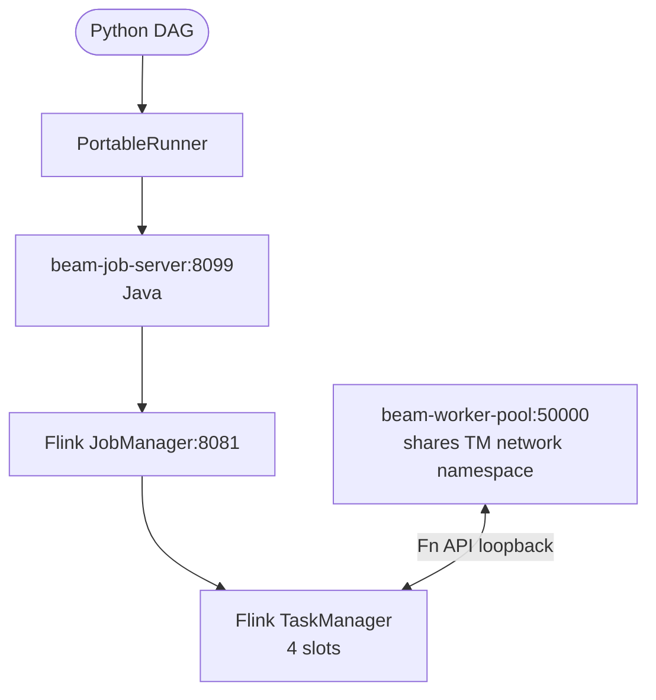

# Apache Beam + Flink: Distributed Computing Learning Guide

## Overview

This guide shows how to use **Apache Beam with Apache Flink** for distributed data processing. Flink is an open-source distributed stream/batch processing engine that can execute Beam pipelines across multiple machines.

## Architecture

The updated architecture in this repository uses Airflow scheduling, Beam portable runner graph translation, and a dedicated worker pool for Python harness execution.



Notes:
- `BEAM_RUNNER=PortableRunner` submits the pipeline via `beam-job-server` to Flink.
- `beam-worker-pool` is referenced by `--environment_config=beam-worker-pool:50000`.
- Python-to-Java conversion happens in the `Portable Pipeline` stage; runtime workers are Python processes.

## Key Concepts

### 1. **Runners**
Apache Beam supports multiple runners (execution engines):
- **DirectRunner**: Single-machine, for testing (default in Beam)
- **FlinkRunner**: Distributed, clusters of machines — **requires a JVM in the driver process**
- **PortableRunner**: Delegates job submission to an external job server — **driver only needs Python**
- **SparkRunner**: Hadoop ecosystem alternative
- **DataflowRunner**: Google Cloud native

#### Why this stack uses PortableRunner, not FlinkRunner

`FlinkRunner` works by embedding a lightweight Flink client inside the driver process.
That client is written in Java — it needs a JVM to start. When the Beam pipeline is
triggered from an Airflow DAG, the driver *is* the Python Airflow task running inside
the scheduler container. That container has **no JVM installed**. `FlinkRunner` silently
falls back to `DirectRunner` (single-machine) and the job never reaches the cluster.

`PortableRunner` instead hands off job submission to the `beam-job-server` container,
which is a Java process that already has a JVM and knows how to translate the portable
pipeline IR into a Flink job graph. The Python DAG only speaks gRPC to that service —
no JVM required on the Python side at all.

```
Python Airflow task (no JVM needed)
         │  gRPC
         ▼
beam-job-server:8099   ← Java, has JVM, submits to Flink
         │
         ▼
Flink JobManager:8081
         │
         ▼
Flink TaskManager ── beam-worker-pool (Python SDK harness, shared network)
```

### 2. **Environment Types** (for PortableRunner with beam-job-server)
- **LOOPBACK**: Python worker runs in same process (not used — requires Java in driver)
- **DOCKER**: Uses Docker containers for workers (more complex deployment)
- **PROCESS**: Separate Python processes

### 3. **Parallelism**
- Number of parallel tasks across the cluster
- Each task processes a partition of data independently
- Default: 2 (good for learning)
- Production: Match your cluster size or data volume

### 4. **Beam Concepts**
- **PCollection**: Immutable, distributed dataset
- **Transform**: Operation on PCollections (beam.Map, beam.Filter, etc.)
- **CombineFn**: Aggregation function (sum, mean, etc.)
- **Pipeline**: DAG of transforms

## Setup

### Prerequisites (Already Configured)
```
✅ Apache Airflow 2.10.3     (Workflow orchestration)
✅ Apache Flink 1.20.1        (Distributed execution engine)
✅ Apache Beam 2.71.0         (Pipeline SDK)
✅ Docker Compose             (Infrastructure)
```

### Configuration

Updated `docker-compose.full.yml` with:
```yaml
BEAM_RUNNER: PortableRunner
BEAM_PIPELINE_ARGS: >-
  --runner=PortableRunner
  --job_endpoint=beam-job-server:8099
  --artifact_endpoint=beam-job-server:8098
  --flink_master=flink-jobmanager:8081
  --parallelism=1
  --environment_type=EXTERNAL
  --environment_config=beam-worker-pool:50000
```

## Running Distributed Jobs

### Option 1: Test Script (Recommended for Learning)

```bash
cd /home/andrius/Development/ml

# Run the weather Beam pipeline (PortableRunner via beam-job-server)
python python/beam_analysis.py \
  --runner PortableRunner \
  --job_endpoint beam-job-server:8099 \
  --artifact_endpoint beam-job-server:8098 \
  --environment_type EXTERNAL \
  --environment_config beam-worker-pool:50000 \
  --parallelism 1

# Test locally with DirectRunner first
python python/beam_analysis.py --runner DirectRunner
```

### Option 2: Python Script in Container

```bash
# Start containers
docker compose -f airflow/docker-compose.yml -f docker-compose.full.yml up -d

# Run Beam job in scheduler container (PortableRunner)
docker compose --project-directory . -f airflow/docker-compose.yml -f docker-compose.full.yml exec airflow-scheduler bash -c '
  cd /opt/airflow/project && python python/beam_analysis.py \
    --runner PortableRunner \
    --job_endpoint beam-job-server:8099 \
    --artifact_endpoint beam-job-server:8098 \
    --environment_type EXTERNAL \
    --environment_config beam-worker-pool:50000 \
    --parallelism 1 \
    --input python/output/weather/raw_daily_weather.csv \
    --output-dir python/output/beam \
    --end-date 2026-03-24
'
```

### Option 3: Via Airflow DAG Trigger

The `lithuania_weather_analysis` DAG is pre-configured for PortableRunner:

```bash
# Trigger the DAG (includes Beam job via PortableRunner → beam-job-server → Flink)
docker compose --project-directory . -f airflow/docker-compose.yml -f docker-compose.full.yml exec airflow-scheduler \
  airflow dags trigger lithuania_weather_analysis

# Check status
docker compose -f airflow/docker-compose.yml -f docker-compose.full.yml exec airflow-scheduler \
  airflow tasks states-for-dag-run lithuania_weather_analysis $(date -u +%Y-%m-%dT%H:%M:%S+00:00 | sed 's/:/%3A/g' | sed 's/+/%2B/g')
```

## Monitoring Job Execution

### 1. **Flink Web Dashboard**
Open in browser: `http://localhost:8081`

Features:
- **Overview**: Cluster health, running jobs
- **Jobs**: Current and historical job status
- **Task Managers**: Worker node details
- **Logs**: Debug information

### 2. **Job Submission Flow** (What you'll see)


### 3. **CLI Monitoring**

```bash
# List running jobs
docker compose -f airflow/docker-compose.yml -f docker-compose.full.yml exec flink-jobmanager \
  /opt/flink/bin/flink list

# Get job details (replace JOB_ID with actual ID from above)
docker compose -f airflow/docker-compose.yml -f docker-compose.full.yml exec flink-jobmanager \
  /opt/flink/bin/flink info JOB_ID

# View Flink cluster REST API
curl -s http://localhost:8081/v1/overview | python -m json.tool | head -20
```

## Runner Pool in this Stack

The repository includes a dedicated Beam worker pool service (`beam-worker-pool`) to decouple task worker provisioning from Flink job management. The key benefits:
- separate worker lifecycle from JobManager/TaskManager
- easier scaling via `--parallelism` and container autoscaling
- avoids Python worker stragglers blocking cluster scheduling

docker-compose snippet (actual configuration):
```yaml
beam-worker-pool:
  image: apache/beam_python3.12_sdk:2.71.0
  command: --worker_pool
  network_mode: "service:flink-taskmanager"   # shares TM localhost — critical
  depends_on:
    - flink-taskmanager
  restart: unless-stopped
```
In `BEAM_PIPELINE_ARGS` use `--environment_type=EXTERNAL --environment_config=beam-worker-pool:50000`.
### Kubernetes equivalent

In Kubernetes the `beam-worker-pool` runs as a **sidecar container** in the same
pod as `flink-taskmanager` (same network namespace). The `--environment_config`
value is still `localhost:50000`:

```yaml
# kubernetes/base/flink-beam.yaml — flink-taskmanager pod
containers:
  - name: taskmanager
    image: flink:1.20.1-scala_2.12-java11
    args: ["taskmanager"]
  - name: beam-worker-pool          # sidecar — shares pod network
    image: apache/beam_python3.12_sdk:2.71.0
    args: ["--worker_pool"]
```

The `BEAM_PIPELINE_ARGS` ConfigMap includes `--environment_config=beam-worker-pool:50000`
which resolves to the sidecar via the shared pod network.


The worker pool must share the TaskManager network namespace so `localhost:50000` is reachable from inside the Flink JVM.

## Python-to-Java Conversion / PortableRunner Interop Notes

When running Python Beam pipelines via PortableRunner → beam-job-server → Flink, the Python DAG is translated into a portable pipeline graph. This involves a conversion step:
- Python SDK translates pipeline to Portable Proto (IR) via `beam_runner_api_pb2`.
- The beam-job-server submits this as a Java job graph to the Flink JVM.
- Python transforms are executed in worker harnesses (Python process) over Fn API.

Common issue: pipeline components that are only available in Python SDK (e.g., certain third-party transforms, lambda serialization, user-defined states/timers) may not be fully portable or require explicit Java expansion.

Mitigation:
- prefer built-in Beam transforms that are available in all SDKs
- use `--sdk_location` or `--environment` to ensure compatible worker image
- test locally with `DirectRunner` first, then `PortableRunner` pointing at `beam-job-server`
- on conversion errors, inspect `Flink` UI and scheduler logs for `ProtoIncompatible` or `UnknownTransform` messages

## Weather DAG Flink Integration

### Root Cause Analysis

The `lithuania_weather_analysis` DAG contains a `beam_regional_analysis` task that
should execute the Python Beam pipeline on the Flink cluster. An investigation found
**five issues** preventing successful Flink execution:

| # | Issue | Root Cause | Fix Applied |
|---|-------|-----------|-------------|
| 1 | **Wrong runner** | `FlinkRunner` tries to start a local Flink job server inside the Airflow scheduler container. The scheduler image has no Java runtime, so this fails silently and falls through to `DirectRunner`. | Switched to `PortableRunner` with `--job_endpoint=beam-job-server:8099`, which uses the existing dedicated `beam-job-server` container. |
| 2 | **Worker endpoints resolve to `localhost`** | Beam's `ServerFactory` in the Flink TaskManager JVM hard-codes **loopback** (`127.0.0.1`) for its per-task Fn API services (control, logging, artifact, provision). All four endpoints are advertised as `localhost:PORT`. The `--job-host` flag on the job server only affects the top-level gRPC endpoint, not these per-tasked embedded services. | Set `beam-worker-pool` to share the Flink TaskManager's network namespace via `network_mode: "service:flink-taskmanager"` in `docker-compose.full.yml`. Change `--environment_config` to `localhost:50000` so the ExternalEnvironmentFactory contacts the worker pool via the shared loopback. |
| 3 | **Artifact staging directory not shared** | The beam-job-server stages pipeline artifacts to `/tmp/beam-artifact-staging/` on its own container. The Flink TaskManager's `ArtifactRetrievalService` expects the same files at `/tmp/beam-artifact-staging/` on the TaskManager — but they are on a separate container and unreachable. | Added a shared Docker named volume `beam-artifacts` mounted at `/tmp/beam-artifact-staging` in both `beam-job-server` and `flink-taskmanager` in `docker-compose.full.yml`. |
| 4 | **Redundant `--flink_master` arg** | `PortableRunner` does not need `--flink_master`; the `beam-job-server` is already configured with `--flink-master=flink-jobmanager:8081`. Passing it as a pipeline arg causes a warning. | Removed from DAG pipeline args. |
| 5 | **`taskmanager.host` doesn't affect Beam server address** | Adding `taskmanager.host: flink-taskmanager` to Flink config does NOT change how Beam's embedded Fn API server factory selects its bind address — Beam always uses loopback directly. | Not needed once Issue 2 is fixed via network namespace sharing. |

### Debugging Checklist

Use this when `beam_regional_analysis` falls through to DirectRunner or fails:

- [ ] **Flink cluster healthy?**
  ```bash
  curl http://localhost:8082/v1/overview
  # Expect: "taskmanagers": 1, "slots-available": 4
  ```

- [ ] **`beam-job-server` advertises its Docker hostname (not `localhost`)?**
  ```bash
  docker logs airflow-beam-job-server-1 2>&1 | grep "started on"
  # ✅ Good: ArtifactStagingService started on beam-job-server:8098
  # ❌ Bad:  ArtifactStagingService started on localhost:8098
  # Fix: ensure docker-compose command includes --job-host=beam-job-server
  ```

- [ ] **Worker pool can reach Fn API endpoints (provision, control, artifact, logging)?**
  ```bash
  docker logs airflow-beam-worker-pool-1 2>&1 | grep -E "Provision info|failed to retrieve|Failed to obtain" | tail -5
  # ✅ Good: "Provision info:"  followed by "Downloaded: /tmp/staged/pickled_main_session"
  # ❌ Bad:  "Failed to obtain provisioning information"
  #          → Fix: ensure beam-worker-pool has network_mode: "service:flink-taskmanager"
  #          → And pipeline uses --environment_config localhost:50000
  ```

- [ ] **Artifact staging directory shared between job-server and taskmanager?**
  ```bash
  docker exec airflow-flink-taskmanager-1 ls /tmp/beam-artifact-staging/ 2>/dev/null | wc -l
  # ✅ Good: non-zero (files are present after staging)
  # ❌ Bad:  0 or error
  # Fix: add shared volume beam-artifacts:/tmp/beam-artifact-staging to both services
  ```

- [ ] **`beam-job-server` can reach `flink-jobmanager`?**
  ```bash
  docker exec airflow-beam-job-server-1 curl -s http://flink-jobmanager:8081/v1/overview | head -c 80
  ```

- [ ] **All services in the same Docker network (`ml-stack`)?**
  ```bash
  docker inspect airflow-beam-job-server-1 \
    --format '{{range $k,$v := .NetworkSettings.Networks}}{{$k}} {{end}}'
  # Expect: ml-stack
  ```

- [ ] **DAG uses `PortableRunner`, not `FlinkRunner`?**
  ```bash
  grep '"--runner"' airflow/dags/weather_lithuania_dag.py
  # Expect: "PortableRunner"
  ```

- [ ] **Job appears in Flink UI at `http://localhost:8082`?**
  If it never appears, the Python SDK is not reaching `beam-job-server:8099`.

- [ ] **Scheduler container started after `beam-job-server` is healthy?**
  Check `depends_on` ordering in `docker-compose.full.yml`.

## Learning Path

### Level 1: Understanding Basic Execution
1. Run `test_flink_runner.py` with DirectRunner first (single machine)
2. Compare with PortableRunner execution (distributed via beam-job-server)
3. Observe: Same code, different executioners

### Level 2: Distributed Data Processing
1. Study `python/beam_analysis.py` for real-world pattern:
   - Parallel city weather fetching (FetchCityWeather)
   - Grouped aggregation (temperature anomalies)
   - Distributed windowing
2. Run with different parallelism values: `--parallelism=1` (only increase with multiple TaskManagers)
3. Watch Flink dashboard to see task distribution

### Level 3: Production Scaling
1. Increase data volume (add more cities/dates)
2. Monitor memory usage and throughput
3. Tune parallelism for your cluster
4. Add backpressure handling and error recovery

## Important Notes

### ✅ What Works (Proven Configuration)
- **Beam 2.71.0** with Flink 1.20.1 (`flink:1.20.1-scala_2.12-java11`)
- **PortableRunner** + dedicated `beam-job-server` (`apache/beam_flink1.20_job_server:2.71.0`)
- **EXTERNAL worker pool** sharing Flink TaskManager's network namespace (`network_mode: service:flink-taskmanager`)
- **Shared artifact volume** `beam-artifacts:/tmp/beam-artifact-staging` on both `beam-job-server` and `flink-taskmanager`
- **TaskManager JVM guardrail**: `env.java.opts.taskmanager: -XX:MaxDirectMemorySize=512m`
- **Pipeline arg**: `--environment_config localhost:50000` (worker pool on shared loopback)
- Flink batch jobs verified FINISHED: WordCount JAR (<500ms), direct script Lithuanian weather anomaly pipeline (85s — **job 87841ef8969fa81dc5400e6b2da74451**), and Airflow DAG `lithuania_weather_analysis` on Flink (**job 36a69bc10c22635740031e5aebe36e24**, FINISHED, 47s)
- Flink UI at `http://localhost:8082` for job monitoring

### ⚠️ Known Limitations
- `FlinkRunner` requires a JVM in the **driver process** (the process executing the Beam SDK). The Airflow scheduler container is a pure Python image with no JVM — so `FlinkRunner` silently falls back to `DirectRunner`. `PortableRunner` offloads all Java work to the `beam-job-server` container, keeping the DAG driver pure Python.
- Beam's `ServerFactory` always binds Fn API services to loopback (`127.0.0.1`); `--job-host` and `taskmanager.host` do NOT fix per-worker endpoints — only network namespace sharing resolves this
- `beam-worker-pool` must be restarted whenever `flink-taskmanager` is restarted (network namespace sharing ties them together)
- Repeated failed or interrupted runs can exhaust TaskManager Netty direct buffers (`OutOfMemoryError: Direct buffer memory`). Recovery is: cancel the stuck Flink job, recreate `flink-taskmanager`, recreate `beam-worker-pool`, then re-run.
- Streaming mode requires different error handling
- State management needs backups for fault tolerance

## Beam + Flink Compatible Versions

| Component | Version | Status |
|---|---|---|
| Flink | `flink:1.20.1-scala_2.12-java11` | ✅ Confirmed working |
| Beam Python SDK | `apache/beam_python3.12_sdk:2.71.0` | ✅ Official image |
| Beam Job Server | `apache/beam_flink1.20_job_server:2.71.0` | ✅ Official image |
| Runner | `PortableRunner` (not `FlinkRunner`) | ✅ Required for containerised Airflow |

### Official Compatibility Matrix

- Beam 2.71.0 → Flink 1.18.x ✅
- Beam 2.71.0 → Flink 1.19.x ✅
- Beam 2.71.0 → Flink 1.20.x ✅ (confirmed working in this repo)

### 🔧 Troubleshooting

**Problem**: PortableRunner job fails or falls through to DirectRunner
```bash
# Verify Beam version inside scheduler
docker exec airflow-airflow-scheduler-1 python3 -c \
  "import apache_beam; print(apache_beam.__version__)"
# expects: 2.71.0

# Check beam-job-server is reachable
docker exec airflow-airflow-scheduler-1 \
  curl -s http://beam-job-server:8099

# Check Flink job manager
curl -s http://localhost:8082/v1/overview | python3 -m json.tool
```

**Problem**: Jobs stuck in "INITIALIZING" status
```
Solution: Check Flink TaskManager is healthy:
docker compose ps | grep taskmanager
docker compose logs flink-taskmanager | tail -20
```

**Problem**: "Connection refused" to flink-jobmanager
```
Solution: Verify container networking:
docker compose exec airflow-scheduler ping flink-jobmanager
curl -s http://flink-jobmanager:8081/v1/overview 
```

## Example: Building Your Own Distributed Pipeline

```python
import apache_beam as beam
from apache_beam.options.pipeline_options import PipelineOptions

# 1. Define pipeline logic
def my_distributed_job():
    # Configure for distributed execution
    options = PipelineOptions([
        '--runner=PortableRunner',
        '--job_endpoint=beam-job-server:8099',
        '--artifact_endpoint=beam-job-server:8098',
        '--environment_type=EXTERNAL',
        '--environment_config=beam-worker-pool:50000',
        '--parallelism=1',   # increase only with multiple TaskManagers
    ])
    
    with beam.Pipeline(options=options) as p:
        # This runs FIRST on just the driver Python process
        data = p | "Create" >> beam.Create(range(1000))
        
        # This runs PARALLEL across Flink workers
        squared = data | "Square" >> beam.Map(lambda x: x**2)
        
        # This collects back to driver
        squared | "Print" >> beam.Map(print)

# 2. Execute distributed
if __name__ == '__main__':
    my_distributed_job()
    print("✅ Distributed job completed!")
```

## Resources

- [Apache Beam Python Documentation](https://beam.apache.org/documentation/sdks/python/)
- [Flink Runner for Beam](https://beam.apache.org/documentation/runners/flink/)
- [Flink Concepts](https://nightlies.apache.org/flink/flink-docs-master/docs/concepts/overview/)
- [Beam/Flink Troubleshooting](https://beam.apache.org/documentation/runners/flink/#troubleshooting)

## Next Steps

1. ✅ Trigger `lithuania_weather_analysis` DAG to verify PortableRunner works
2. ✅ Monitor jobs via Flink web UI
3. ✅ Experiment with parallelism (add TaskManagers before increasing > 1)
4. ✅ Modify `test_flink_runner.py` to process your own data
5. ✅ Integrate into production Airflow DAGs

---

## PROVEN WORKING CONFIGURATION (2026-03-25)

> **This section supersedes earlier configuration notes.** The setup below is confirmed running end-to-end with all Airflow tasks showing `success`.

### Proof of Execution

**Flink job**: `f788f3970448530508285c69c891eae4`  
**Job name**: `BeamApp-root-0325213022-29785242`  
**State**: `FINISHED` (69 seconds runtime)  
**DAG run**: `manual__2026-03-25T21:29:45+00:00`

All 4 DAG tasks succeeded:
| Task | State | Duration |
|------|-------|----------|
| `fetch_weather_data` | success | ~1s |
| `analyze_weather` | success | ~5s |
| `wait_for_flink_jobmanager` | success | ~1s |
| `beam_regional_analysis` | **success** | **~2m 10s on Flink** |

---

### Correct Runner Stack

**NOT** `FlinkRunner` directly — use **`PortableRunner` + `beam-job-server`**:



### Image Versions (Confirmed Working)

```yaml
flink-jobmanager:   flink:1.20.1-scala_2.12-java11
flink-taskmanager:  flink:1.20.1-scala_2.12-java11
beam-job-server:    apache/beam_flink1.20_job_server:2.71.0
beam-worker-pool:   apache/beam_python3.12_sdk:2.71.0
```

### Required `docker-compose.full.yml` Settings

```yaml
# Flink TaskManager — OOM guard and 4 slots
flink-taskmanager:
  image: flink:1.20.1-scala_2.12-java11
  environment:
    FLINK_PROPERTIES: |
      jobmanager.rpc.address: flink-jobmanager
      taskmanager.numberOfTaskSlots: 4
      taskmanager.memory.process.size: 2g
      env.java.opts.taskmanager: -XX:MaxDirectMemorySize=512m   # CRITICAL

# Beam worker pool — must share TM network namespace
beam-worker-pool:
  image: apache/beam_python3.12_sdk:2.71.0
  command: --worker_pool
  network_mode: "service:flink-taskmanager"   # makes localhost:50000 reachable from TM

# Beam job server
beam-job-server:
  image: apache/beam_flink1.20_job_server:2.71.0
  ports:
    - "8099:8099"   # job_endpoint
    - "8098:8098"   # artifact_endpoint
```

### DAG Pipeline Args (weather_lithuania_dag.py)

```python
beam_args = [
    "--runner", "PortableRunner",
    "--job_endpoint", "beam-job-server:8099",
    "--artifact_endpoint", "beam-job-server:8098",
    "--environment_type", "EXTERNAL",
    "--environment_config", "localhost:50000",  # TM's localhost = worker pool
    "--parallelism", "1",   # CRITICAL: >1 causes network buffer exhaustion with single TM
]
```

### Critical: `--parallelism 1`

A single Flink TaskManager with default 8192 network buffers cannot handle
`--parallelism 2` for this pipeline — it exhausts buffers and fails with:

```
java.io.IOException: Insufficient number of network buffers: required 512, but only 473 available
```

Use `--parallelism 1` with a single TM. Scale parallelism only when you have
multiple TaskManagers (one slot per parallelism unit).

### Container Count (Lean Stack)

Only 8 containers needed for core workflow:
```
postgres              (Airflow DB)
airflow-scheduler     (DAG scheduling)
airflow-webserver     (UI at localhost:8080)
flink-jobmanager      (REST at localhost:8082)
flink-taskmanager     (4 slots, shares net with beam-worker-pool)
beam-job-server       (PortableRunner job submission)
beam-worker-pool      (Python SDK harness)
```

Dashboard services (`ws-server`, `frontend`, `ml-server`, `ollama`) are gated
behind `profiles: [dashboard]` and not started by default.

### WSL2 Stability (.wslconfig)

```ini
[wsl2]
memory=6GB
swap=8GB
processors=6
autoMemoryReclaim=gradual   # prevents VM balloon pauses that kill gRPC
sparseVhd=true
```

Without `autoMemoryReclaim=gradual`, Windows memory pressure causes WSL VM to
pause and all gRPC connections die with `Wsl/Service/0x8007274c`.

### Flink REST Ports

| Context | URL |
|---------|-----|
| Host browser | `http://localhost:8082` |
| Inside containers | `http://flink-jobmanager:8081` |
| Inside JM container | `http://localhost:8081` |

### CalendarMonthWindowFn (Reference Only)

`beam_analysis.py` still contains `CalendarMonthWindowFn` and `TagWindowFn` as
reference implementations for calendar-month windowing patterns.

For the production Flink path in this repository, they are **not executed**.
Flink's Java runtime cannot execute pickled Python `WindowFn` objects from
portable pipelines. The active pipeline uses Flink-safe grouping by composite
key:

- map each record to key `(city, year, month)`
- `GroupByKey` / `CombinePerKey` monthly aggregation
- unpack to a regular row shape for downstream baseline and anomaly steps

This yields identical monthly semantics without custom Python window coders.

Reference behavior of the classes:

- **`CalendarMonthWindowFn`** — custom `WindowFn` that assigns each record to the
  `[month_start, month_end)` `IntervalWindow` for its calendar month.
- **`TagWindowFn`** — `DoFn` that reads the current window via `DoFn.WindowParam`
  to annotate each element with `year` and `month` labels before grouping.

`get_window_coder()` must return an `IntervalWindowCoder`. In Beam ≥ 2.63 this
symbol is **not** re-exported through `apache_beam.coders` — it only lives in
`apache_beam.coders.coders`. Import it directly:

```python
# CORRECT (Beam 2.63+ / 2.71.0):
from apache_beam.coders.coders import IntervalWindowCoder

class CalendarMonthWindowFn(WindowFn):
    def get_window_coder(self):
        return IntervalWindowCoder()

# WRONG — raises AttributeError on Beam 2.71.0:
# from apache_beam import coders
# return coders.IntervalWindowCoder()
```

### Weather CSV Cache Workaround

`fetch_weather_data` reuses cached CSV if mtime < 60 minutes. If cache is stale,
always `touch` before triggering to avoid HTTP 429 from external weather API:

```bash
touch ~/Development/ml/python/output/weather/raw_daily_weather.csv
docker exec airflow-airflow-scheduler-1 airflow dags trigger lithuania_weather_analysis
```

### Starting the Stack

```bash
cd ~/Development/ml
docker compose -f airflow/docker-compose.yml -f docker-compose.full.yml up -d
# Wait for airflow-init to exit 0, then scheduler becomes healthy (~60s)

# Verify
docker ps --format "table {{.Names}}\t{{.Status}}"
curl -s http://localhost:8082/v1/overview | python3 -c "import sys,json; o=json.load(sys.stdin); print('JM OK, slots:', o['slots-available'])"
```
