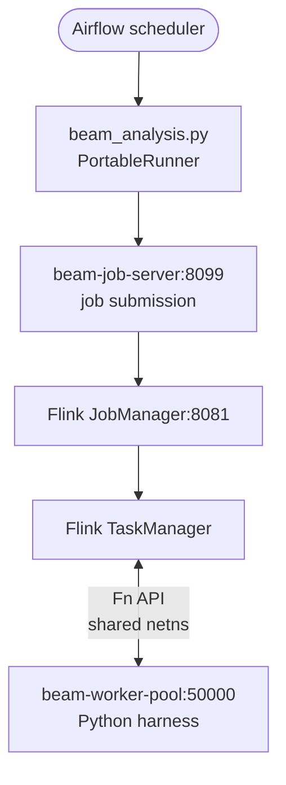

# ✅ Flink + Beam PortableRunner Setup

## Current Working Configuration

| Component | Version |
|-----------|---------|
| Apache Beam | 2.71.0 |
| Apache Flink | 1.20.1 |
| Beam job server image | `apache/beam_flink1.20_job_server:2.71.0` |
| Beam worker pool image | `apache/beam_python3.12_sdk:2.71.0` |
| Runner | `PortableRunner` (not `FlinkRunner`) |
| Environment type | `EXTERNAL` |

## Architecture

Pipelines run as **Beam PortableRunner → beam-job-server → Flink 1.20.1**.
The `beam-worker-pool` container runs Python SDK harness code and shares the
network namespace of `flink-taskmanager` so `localhost:50000` is reachable from
inside the TaskManager JVM.



## Key Docker Compose Settings

```yaml
# flink-taskmanager
flink-taskmanager:
  image: flink:1.20.1-scala_2.12-java11
  environment:
    FLINK_PROPERTIES: |
      taskmanager.numberOfTaskSlots: 4
      taskmanager.memory.process.size: 2g
      env.java.opts.taskmanager: -XX:MaxDirectMemorySize=512m

# beam-worker-pool — must share TM network namespace
beam-worker-pool:
  image: apache/beam_python3.12_sdk:2.71.0
  command: --worker_pool
  network_mode: "service:flink-taskmanager"

# beam-job-server
beam-job-server:
  image: apache/beam_flink1.20_job_server:2.71.0
  command: ["--flink-master=flink-jobmanager:8081", "--job-host=beam-job-server"]
```

## Pipeline Args (used in `beam_analysis.py`)

```python
beam_args = [
    "--runner", "PortableRunner",
    "--job_endpoint", "beam-job-server:8099",
    "--artifact_endpoint", "beam-job-server:8098",
    "--environment_type", "EXTERNAL",
    "--environment_config", "localhost:50000",
    "--parallelism", "1",   # CRITICAL — see note below
]
```

### Why `--parallelism 1`

A single Flink TaskManager with default network buffers cannot sustain
`--parallelism 2` for this pipeline:

```
java.io.IOException: Insufficient number of network buffers: required 512, but only 473 available
```

Increase parallelism only when you have multiple TaskManagers.

## Starting the Stack

```bash
cd ~/Development/ml
docker compose --project-directory . -f airflow/docker-compose.yml -f docker-compose.full.yml up -d
```

Wait for `airflow-init` to exit 0, then the scheduler becomes healthy (~60 s).

Verify:

```bash
docker ps --format "table {{.Names}}\t{{.Status}}"
curl -s http://localhost:8082/v1/overview | python3 -c \
  "import sys,json; o=json.load(sys.stdin); print('JM OK, slots:', o['slots-available'])"
```

## Triggering a Beam DAG

```bash
# From inside the scheduler container
docker exec airflow-airflow-scheduler-1 \
  airflow dags trigger lithuania_weather_analysis

# Monitor Flink jobs
open http://localhost:8082
```

> **Note**: Flink REST is exposed on host port **8082** (not 8081).
> Inside containers, use `flink-jobmanager:8081`.

## Monitoring

```bash
# List running jobs
docker exec flink-jobmanager /opt/flink/bin/flink list

# REST API
curl -s http://localhost:8082/v1/jobs | python3 -m json.tool

# Logs
docker compose --project-directory . -f airflow/docker-compose.yml -f docker-compose.full.yml \
  logs --tail=50 flink-taskmanager beam-worker-pool beam-job-server
```

## Troubleshooting

### Check Beam version inside scheduler
```bash
docker exec airflow-airflow-scheduler-1 python3 -c \
  "import apache_beam; print(apache_beam.__version__)"
# expects: 2.71.0
```

### gRPC connection dies after idle
WSL2 memory balloon kills gRPC streams. Add to `%UserProfile%\.wslconfig`:

```ini
[wsl2]
memory=6GB
swap=8GB
autoMemoryReclaim=gradual
```

### Jobs stuck in INITIALIZING
```bash
docker compose --project-directory . -f airflow/docker-compose.yml -f docker-compose.full.yml \
  logs flink-taskmanager | tail -30
```

### Weather CSV cache stale (HTTP 429 from API)
```bash
touch ~/Development/ml/python/output/weather/raw_daily_weather.csv
docker exec airflow-airflow-scheduler-1 airflow dags trigger lithuania_weather_analysis
```

## See Also

- `BEAM_FLINK_GUIDE.md` — comprehensive Beam + Flink learning guide
- `python/beam_analysis.py` — the main Beam pipeline implementation
- Apache Beam docs: <https://beam.apache.org>
- Flink docs: <https://flink.apache.org>
