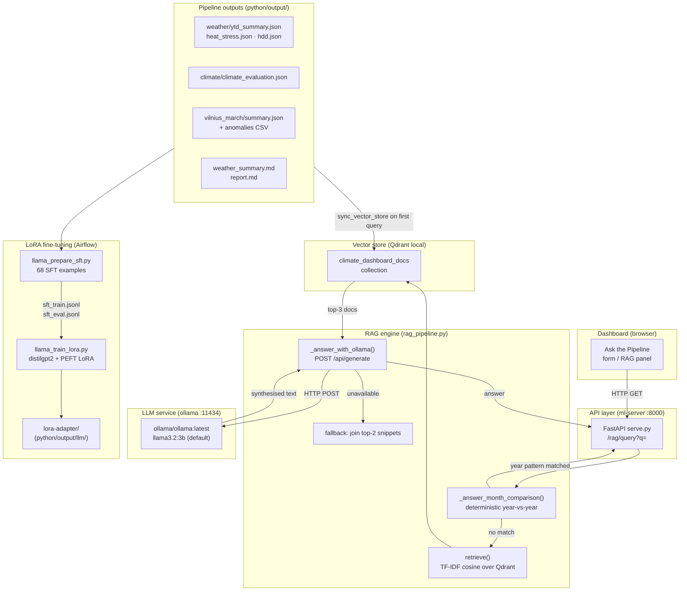
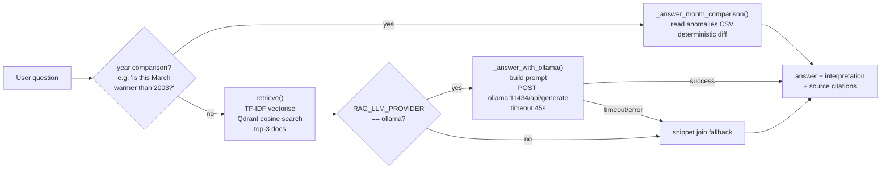
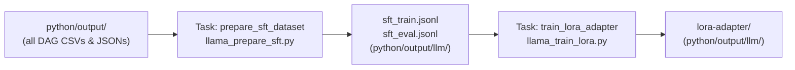

# GenAI Guide — Ollama, RAG, and LoRA Fine-Tuning

This guide explains the two GenAI subsystems in this project:

1. **RAG + Ollama** — runtime question answering over pipeline outputs.
2. **LoRA fine-tuning** — periodic adaptation of a small language model using
   Airflow-generated training data.

---

## Architecture overview



---

## 1 — RAG + Ollama (runtime Q&A)

### How a question flows



### Vector store

`rag_pipeline.py` builds a **local Qdrant collection** (`climate_dashboard_docs`)
from the pipeline output directory the first time a query arrives (or when
`sync_vector_store` is called explicitly). The corpus includes:

| Document | Source |
|---|---|
| Lithuania YTD weather overview | `weather/ytd_summary.json` |
| City anomaly rankings | `weather/city_rankings.json` |
| Vilnius month anomaly overview | `vilnius_*/summary.json` |
| Vilnius month historical extremes | `vilnius_*/*_temperature_anomalies.csv` |
| Climate model evaluation (R², RMSE, MAE) | `climate/climate_evaluation.json` |
| Pipeline narrative reports | `weather/weather_summary.md`, `vilnius_*/report.md` |

Documents are tokenised with a custom TF-IDF vectoriser (unigrams + bigrams,
stop-word filtered). The vectoriser and Qdrant database are persisted under
`python/output/rag/`.

### Ollama prompt

`_answer_with_ollama()` sends a grounded prompt — it is **context-only**: the
model is instructed not to use prior knowledge outside the retrieved snippets.

```
You are a climate dashboard assistant. Answer using only the provided context.
If the answer is not in context, say so briefly. Keep answer concise and factual.

Question: <user question>

Context:
[1] Lithuania YTD weather overview (weather/ytd_summary.json)
<text>
[2] ...
```

The raw Ollama response is passed through `_interpret_answer()`, which adds a
plain-language interpretation of temperature anomalies, z-scores, and R² values.

### Deterministic fast path

Questions that match the pattern **"is this `<month>` warmer/colder than `<year>`?"**
skip Ollama entirely. `_answer_month_comparison()` reads the anomaly CSV directly
and computes the difference:

> *"Yes. Vilnius March 2026 is warmer than 2003. Mean temperature is 4.80 °C
> versus −0.93 °C, a difference of +5.73 °C over the same cutoff window."*

---

## 2 — LoRA fine-tuning (Airflow DAG)

The `llama_dag_finetune` DAG is a **manual-trigger only** pipeline that adapts a
lightweight language model to the vocabulary and structure of this project's data.

### Pipeline steps



### SFT dataset (`llama_prepare_sft.py`)

Reads all pipeline artifacts and generates **68 instruction-answer pairs**
(54 train / 14 eval) covering:

- Lithuania weather summaries and anomaly assessments
- City-level anomaly rankings
- Vilnius month anomaly context with z-score interpretation
- Climate model performance (R², RMSE, MAE)
- **Year-vs-year March comparisons** — 29 pairs of the form
  *"Is this March warmer than 2003? Yes, 2026 (4.80 °C) is warmer by +5.73 °C"*

The dataset uses only stdlib `csv` (no pandas dependency in the prep step).

### Model (`llama_train_lora.py`)

| Setting | Default | Override |
|---|---|---|
| Base model | `distilgpt2` (82M params) | `LLAMA_BASE_MODEL` env var |
| Adapter method | LoRA (PEFT) | — |
| Max sequence length | 256 tokens | `--max-length` CLI arg |
| Training speed | ~1–2 min on CPU | — |
| Adapter output | `python/output/llm/lora-adapter/` | `--output-dir` |

The LoRA adapter is a thin layer on top of the frozen base model; it is **not
used by Ollama at runtime** — the two subsystems are independent. The adapter is
intended for offline analysis and potential export to GGUF / Ollama model import.

---

## 3 — Docker services

Both services run under the `dashboard` Compose profile.

```yaml
# docker-compose.full.yml (abbreviated)
ml-server:
  profiles: [dashboard]
  command: uvicorn serve:app --host 0.0.0.0 --port 8000
  environment:
    RAG_LLM_PROVIDER: ${RAG_LLM_PROVIDER:-ollama}
    OLLAMA_BASE_URL: http://ollama:11434
    OLLAMA_MODEL: ${OLLAMA_MODEL:-llama3.2:3b}
  depends_on:
    - ollama

ollama:
  profiles: [dashboard]
  image: ollama/ollama:latest
  ports:
    - 11434:11434
  volumes:
    - ollama-data:/root/.ollama   # models persist across restarts
```

### First-run: pull the model

The Ollama container starts with no models downloaded. Pull before querying:

```bash
docker compose --project-directory . -f docker-compose.full.yml \
  --profile dashboard exec ollama ollama pull llama3.2:3b
```

To use a different model (e.g. `mistral:7b`):

```bash
OLLAMA_MODEL=mistral:7b docker compose --project-directory . \
  -f docker-compose.full.yml --profile dashboard up -d
```

---

## 4 — Environment variables

| Variable | Default | Description |
|---|---|---|
| `RAG_LLM_PROVIDER` | `ollama` | Set to `extractive` to disable Ollama and return snippet text only |
| `OLLAMA_BASE_URL` | `http://ollama:11434` | Ollama endpoint (override for remote instance) |
| `OLLAMA_MODEL` | `llama3.2:3b` | Model tag to use for generation |
| `ML_OUTPUT_DIR` | `python/output` | Root of pipeline artifacts read by the RAG engine |
| `LLAMA_BASE_MODEL` | `distilgpt2` | Base model for LoRA fine-tuning |

---

## 5 — Running without Ollama

Set `RAG_LLM_PROVIDER=extractive` to skip Ollama entirely. The RAG engine will
still retrieve relevant documents and return the first sentences of the top-2
matches as the answer. This is the default behaviour in CI (via
`docker-compose.ci.yml`, which stubs `ollama` with an Alpine container).

---

## 6 — Trigger the fine-tuning DAG

In the Airflow UI (<http://localhost:8080>), find **llama_dag_finetune** and
click **Trigger DAG**. No parameters needed.

From the CLI:

```bash
docker compose --project-directory . -f airflow/docker-compose.yml \
  exec airflow-webserver airflow dags trigger llama_dag_finetune
```

The adapter will appear at `python/output/llm/lora-adapter/` when the run
completes.
