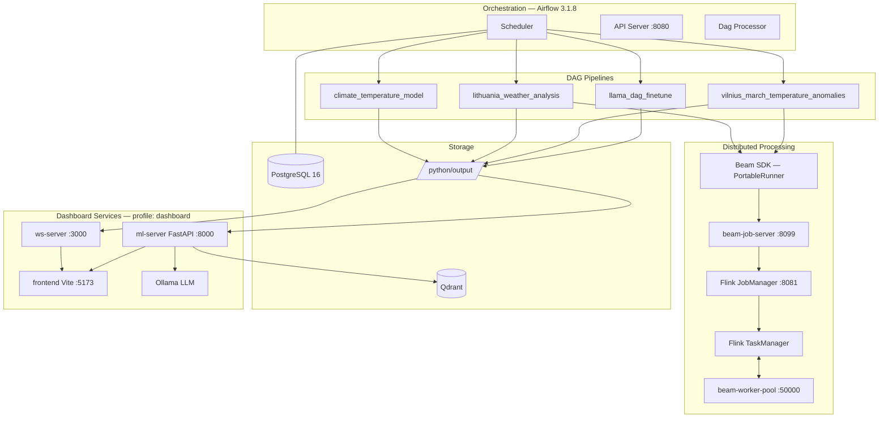
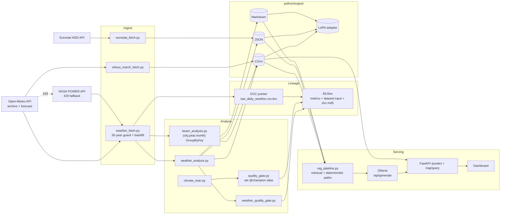

# Lithuania Climate Anomaly Dashboard

End-to-end MLOps workflow for ERA5 climate analytics with Airflow orchestration,
PyTorch training, Qdrant-backed retrieval, and a live dashboard.

## Prerequisites

- Python 3.11+ managed by [uv](https://docs.astral.sh/uv/)
- Node.js 18+ and npm
- Docker and Docker Compose (for the full stack)
- kubectl (optional — for Kubernetes deployment)

## Stack

| Layer | Technology |
|---|---|
| Orchestration | Apache Airflow 3.1.8 + PostgreSQL 16 |
| Data | Open-Meteo ERA5 reanalysis · Eurostat HDD |
| Distributed processing | Apache Beam 2.71.0 · PortableRunner → Flink 1.20.1 |
| Local processing | Python 3.11, pandas, numpy |
| Modeling | PyTorch, MLflow-skinny · ClimateModel dynamic input_dim (3–8 features) |
| LLM fine-tuning | distilgpt2 + LoRA (PEFT), 68 SFT examples |
| Retrieval | Qdrant local store + lightweight TF-IDF |
| Frontend | Vite/nginx, vanilla JS, Chart.js |
| Live updates | Node 20 WebSocket server + periodic export |
| Deployment | Docker Compose · Kubernetes (Kustomize) · ArgoCD · MicroShift |
| CI | GitHub Actions (build + stack-smoke) |

## MicroShift local Kubernetes (edge)

This project supports local edge-style Kubernetes with MicroShift. Use the helper in `openshift-at-home/install-okd.sh`.

1. Ensure Docker is running.

```bash
cd /home/andrius/Development/openshift-at-home
sudo bash install-okd.sh microshift
```

2. Confirm the cluster is healthy:

```bash
kubectl --insecure-skip-tls-verify get nodes
kubectl --insecure-skip-tls-verify get pods -A
```

3. Apply the ml stack overlay:

```bash
kubectl apply -k /home/andrius/Development/ml/kubernetes/overlays/minikube
```

4. Track readiness:

```bash
kubectl get pods -n ml-stack -w
kubectl get pvc -n ml-stack
```

5. (Optional) use MicroShift explicit kubeconfig:

```bash
export KUBECONFIG=/tmp/microshift-config
kubectl get nodes
```

> Note: if you run k3s/kind/minikube concurrently, stop those clusters first to avoid 6443 port conflict.

## Architecture



## 8GB Local Kubernetes Tuning

If your host has 8GB RAM, apply lower resource profiles before bootstrapping the full stack:

1. set `ollama` replica count to `0` in `kubernetes/base/dashboard.yaml` (it is heavy).
2. reduce Flink and Beam CPU/memory in `kubernetes/base/flink-beam.yaml` (JM=250m/512Mi, TM=250m/512Mi, Beam=150m/256Mi).
3. keep the Airflow API server above its minimum concurrency floor in `kubernetes/airflow.yaml` (use at least 2 `airflow api-server` workers and roughly `200m` CPU / `512Mi` memory request with a `1Gi` limit); reduce scheduler and dag-processor more cautiously.
4. reduce mlflow resources in `kubernetes/base/mlflow.yaml` (60m/150Mi limit 300m/500Mi).

Re-apply with:

```bash
kubectl apply -f kubernetes/base/pvcs.yaml
kubectl apply -f kubernetes/base/airflow.yaml
kubectl apply -f kubernetes/base/mlflow.yaml
kubectl apply -f kubernetes/base/dashboard.yaml
kubectl apply -f kubernetes/base/flink-beam.yaml
kubectl get pods -n ml-stack -w
```

For debugging:

```bash
kubectl describe pod -n ml-stack <pod-name>
kubectl logs -n ml-stack <pod-name>
kubectl top node
kubectl top pods -n ml-stack
```

## Data Flow



## DAGs

Current DAG IDs:

- climate_temperature_model
- lithuania_weather_analysis
- vilnius_march_temperature_anomalies
- llama_dag_finetune (manual)

Simplified overlap note:

- `vilnius_march_temperature_anomalies` now reuses `python/output/weather/raw_daily_weather.csv` produced by `lithuania_weather_analysis` instead of running a second API fetch.
- Run `lithuania_weather_analysis` first when starting from an empty workspace.

## Recent Dashboard Notes

- Heating Degree Days (HDD) use Eurostat's `nrg_chdd_m` dataset, which can lag
  current time by many months. The dashboard now falls back to the latest year
  with published data instead of showing zeroes for the current year.
- Regional Beam heatmaps are backed by full month-by-month anomaly data in
  `beam_summary.json`. Historical years contain 12 months; only the current
  in-progress year may have partial months.
- The live dashboard served through Docker uses the frontend nginx proxy for
  `/api/*` requests. If `ml-server` is restarted, nginx now re-resolves Docker
  DNS automatically so RAG queries keep working without a manual frontend restart.
- The weather pipeline logs extended MLflow metrics beyond temperature: YTD
  snowfall (cm), sunshine hours, mean wind speed (km/h), and evapotranspiration
  (ET₀ mm). A separate `quality_gate` run is also logged per pipeline execution
  with pass/fail status and monthly anomaly counts.
- `weather_fetch.py` protects the 1991–2020 baseline with an incremental merge
  strategy: only the delta since the last stored date is fetched; if the API
  returns fewer than 180 days (e.g. after a 429 rate-limit), the result is merged
  rather than overwriting the historical CSV. A final guard never writes a file
  with fewer than five years of data.
- `ClimateModel` now accepts a dynamic `input_dim` (default 3). When the weather
  CSV includes snowfall, sunshine, wind, and ET₀ columns, `climate_data.py`
  engineers up to 5 additional features and writes `feature_columns.json` and
  `feature_defaults.json` to `python/output/climate/`. Training and evaluation
  both read from these manifests rather than hardcoding the column list.
- `beam_analysis.py` imports `IntervalWindowCoder` directly from
  `apache_beam.coders.coders` — the symbol is not re-exported via
  `apache_beam.coders` in Beam ≥ 2.63 and attempting the short form raises
  `AttributeError` at pipeline submission time.
pipeline artifacts.

## Quick Start

### 1. Install dependencies

```bash
cd ml
uv sync          # Python deps
npm install       # JS deps
```

### 2. Validate tests

```bash
uv run python -m pytest python/tests -q
```

Current verified status: 45 passed.

### 3. Export dashboard data

```bash
uv run python python/export_frontend_data.py
```

This reads pipeline outputs under python/output/ and writes src/data/dashboard.json.

### 4. Start dashboard UI

```bash
npm run dev
```

Open http://localhost:5173. You will see:

- KPI cards for current Lithuanian temperature and precipitation anomalies
- A 30-year Vilnius March anomaly bar chart
- City-level z-score comparisons
- ML model regression metrics
- Vector RAG Briefings assembled from pipeline artifacts
- An "Ask the Pipeline" form for live retrieval queries

## Docker Stack

The fastest way to run everything (Airflow + dashboard + RAG API):

Use `docker compose` below. On systems with Docker Compose v2 installed as a
Docker plugin, `docker-compose` may not exist.

```bash
docker compose --project-directory . -f airflow/docker-compose.yml -f docker-compose.full.yml up -d --build
```

MLflow persistence note:
- Compose now stores tracking DB at `../mlruns` and model artifacts at
  `../mlartifacts` with `--default-artifact-root file:///mlartifacts`.
- This prevents model-version metadata from pointing to missing `MLmodel` files
  after container restarts.

First-time setup:

```bash
docker compose --project-directory . -f airflow/docker-compose.yml -f docker-compose.full.yml up airflow-init
docker compose --project-directory . -f airflow/docker-compose.yml -f docker-compose.full.yml up -d --build
```

Repeat runs after the admin user already exists:

```bash
docker compose --project-directory . -f airflow/docker-compose.yml -f docker-compose.full.yml up -d --build
```

### Built vs external images

The `Docker Images` GitHub Actions workflow builds and publishes only the
project-owned images from this repository:

- `ghcr.io/<owner>/ml-airflow-custom`
- `ghcr.io/<owner>/ml-ws-server`
- `ghcr.io/<owner>/ml-frontend`
- `ghcr.io/<owner>/ml-ml-pipeline`

These correspond to the four Dockerfiles under `docker/`.

The full stack also uses several upstream runtime images that are **not** built
by this repository and are pulled directly from their original registries:

- `postgres:16-alpine`
- `flink:1.20.1-scala_2.12-java11`
- `apache/beam_python3.12_sdk:2.71.0`
- `apache/beam_flink1.20_job_server:2.71.0`
- `ollama/ollama:latest`

So the Docker publishing workflow covers all custom repo-owned images, but not
every image referenced by Compose or Kubernetes manifests.

If you only need to sync the Airflow schema without re-running user creation:

```bash
docker compose --project-directory . -f airflow/docker-compose.yml -f docker-compose.full.yml run --rm --entrypoint /bin/bash airflow-init -lc "airflow db migrate"
```

To use prebuilt GHCR images (no local image build), pull and run:

```bash
export GHCR_OWNER=andrius
echo <github_pat> | docker login ghcr.io -u YOUR_GITHUB_USERNAME --password-stdin
docker compose --project-directory . -f airflow/docker-compose.yml -f docker-compose.full.yml pull
docker compose --project-directory . -f airflow/docker-compose.yml -f docker-compose.full.yml up -d
```

The GHCR images are intended to stay private. Authenticate before pulling them
locally. If you ever change a GHCR package to public in GitHub, GitHub does not
allow changing that package back to private.

Once running, trigger DAGs from Airflow UI at http://localhost:8080. Login with `admin` and the auto-generated password from `/opt/airflow/simple_auth_manager_passwords.json.generated` inside the webserver pod.
The dashboard at http://localhost:5173 updates automatically via WebSocket.

## Kubernetes Deployment

The `kubernetes/` folder contains Kustomize base manifests plus overlays for
minikube (laptop) and production, with optional ArgoCD GitOps support.

```
kubernetes/
├── base/                    # shared manifests for all services
├── overlays/
│   ├── minikube/            # standard storageClass, scaled-down resources
│   └── production/          # nfs-client RWX storageClass placeholder
├── argocd/
│   ├── application.yaml             # production — selfHeal=true, prune=true
│   └── application-minikube.yaml    # dev/minikube
└── deploy-minikube.sh       # convenience script
```

MLflow in Kubernetes:
- `kubernetes/base/mlflow.yaml` runs the MLflow server.
- `kubernetes/base/pvcs.yaml` includes `mlflow-data` and `mlflow-artifacts`
  PVCs for persistent backend DB and artifact files.
- `kubernetes/base/configmaps.yaml` sets `MLFLOW_TRACKING_URI=http://mlflow:5000`
  for Airflow and `ml-server`.

### Minikube — standalone (kubectl apply)

```bash
bash kubernetes/deploy-minikube.sh
# then add to /etc/hosts: $(minikube ip)  ml-stack.local
```

### Minikube — via ArgoCD

```bash
bash kubernetes/deploy-minikube.sh --argocd
```

### Production — standalone (k3s two-node)

The production overlay targets a two-node k3s cluster connected via Tailscale:

| Node | Role | Tailscale IP | Label |
|------|------|-------------|-------|
| `desktop-nnutaj7` (WSL) | control-plane + infra workloads | `100.95.8.71` | `workload-role=infra` |
| `k3s-worker-worker` (Mac) | compute workloads | `100.66.184.9` | `workload-role=compute` |

Compute pods (ollama, flink-taskmanager, beam-job-server) are scheduled on the Mac worker; infra pods (airflow, mlflow, postgres, flink-jobmanager) stay on WSL.

All custom images are pulled from GHCR (`ghcr.io/andrius-eng/ml-*`). A `ghcr-secret` imagePullSecret must exist in `ml-stack`:

```bash
kubectl create secret docker-registry ghcr-secret \
  --docker-server=ghcr.io \
  --docker-username=andrius-eng \
  --docker-password=$(gh auth token) \
  -n ml-stack
```

Apply:

```bash
kubectl apply -k kubernetes/overlays/production
```

TLS cert note (production overlay):

- `kubernetes/overlays/production/ml-stack-tls-secret.yaml` is applied with the overlay.
- Regenerate it after certificate rotation:

```bash
kubectl create secret tls ml-stack-tls -n ml-stack \
  --cert=kubernetes/certs/tls.crt \
  --key=kubernetes/certs/tls.key \
  --dry-run=client -o yaml > kubernetes/overlays/production/ml-stack-tls-secret.yaml
```

### Production — ArgoCD GitOps

```bash
kubectl apply -n argocd -f kubernetes/argocd/application.yaml
```

The ArgoCD application tracks the `kubernetes/overlays/production` path on the
`main` branch and auto-syncs with prune + selfHeal.

### Key architecture notes

- `beam-worker-pool` runs as a **sidecar** in the `flink-taskmanager` pod,
  sharing the network namespace (equivalent to `network_mode: service:flink-taskmanager` in Compose).
- All RWX PVCs use `storageClassName: standard` on minikube (hostPath). Swap
  `nfs-client` in `overlays/production/pvc-patch.yaml` for your RWX class.
- Services are exposed via Gateway API (HTTPRoutes) with HTTPS terminated at `https://ml-stack.local`.
  Self-signed CA cert generated by `kubernetes/scripts/setup-gateway.sh`.

### Gateway API + TLS setup

The stack uses Kubernetes Gateway API (replacing deprecated nginx Ingress).
Traefik 3.x in k3s acts as the gateway controller.

One-time setup:

```bash
bash kubernetes/scripts/setup-gateway.sh
```

This enables the Traefik Gateway provider, generates a self-signed CA + server cert,
and creates the `ml-stack-tls` k8s secret. Then trust the CA on your OS:

```bash
# WSL/Ubuntu
sudo cp kubernetes/certs/ca.crt /usr/local/share/ca-certificates/ml-stack-local-ca.crt
sudo update-ca-certificates

# Windows (PowerShell as admin — for browser HTTPS)
Import-Certificate -FilePath \\wsl.localhost\Ubuntu\home\andrius\Development\ml\kubernetes\certs\ca.crt -CertStoreLocation Cert:\LocalMachine\Root

# macOS
sudo security add-trusted-cert -d -r trustRoot -k /Library/Keychains/System.keychain kubernetes/certs/ca.crt
```

Add `ml-stack.local` to your hosts file pointing to `100.95.8.71`.

### Airflow 3 notes

Airflow 3.x introduces breaking changes versus 2.x:

- The webserver is now an **API server** (`airflow api-server`) — the old `airflow webserver` command no longer exists.
- A **separate dag-processor** deployment (`airflow dag-processor`) is required. It runs as its own pod and writes parsed DAGs to the DB. Setting `AIRFLOW__SCHEDULER__STANDALONE_DAG_PROCESSOR=False` keeps dag-processor integrated.
- User management is handled by **SimpleAuthManager** via the `AIRFLOW__CORE__SIMPLE_AUTH_MANAGER_USERS` env var (e.g. `admin:Admin`). The `airflow users create` CLI command is removed.
- Passwords for SimpleAuthManager are auto-generated on first start and written to `/opt/airflow/simple_auth_manager_passwords.json.generated` inside the pod.
- The `AIRFLOW__API__AUTH_BACKENDS` setting from Airflow 2.x is deprecated and removed.
- The `airflow-init` Job only runs `airflow db migrate` — no user creation needed.
- DAGs baked into the image at `/opt/airflow/dags` are hidden by the `airflow-data` PVC mount. A `sync-dags` init container on scheduler and dag-processor copies them from the image into the PVC on startup.
- On NFS-backed deployments, pre-own the `airflow-data` export as UID `50000` and GID `500`, and run Airflow pods with the same `50000:500` identity. Leaving the primary group as `0` causes new DAG and log files to drift to `*:0` ownership on restart.


## Airflow (Local Standalone)

> **Note:** The Kubernetes deployment runs Airflow 3.1.8. The local standalone
> below is for quick development iteration only.

Run in its own terminal:

```bash
cd ml/airflow

export AIRFLOW_HOME="$PWD/.airflow"
export AIRFLOW__CORE__DAGS_FOLDER="$PWD/dags"
export AIRFLOW__CORE__LOAD_EXAMPLES=False
export ML_PROJECT_ROOT="$PWD/.."
export TRAIN_PYTHON_BIN="$PWD/../.venv/bin/python"

env -u VIRTUAL_ENV uv run airflow standalone
```

Open http://localhost:8080. Password is in `.airflow/simple_auth_manager_passwords.json.generated` (Airflow 3.x) or `.airflow/standalone_admin_password.txt` (Airflow 2.x).

Trigger a DAG manually:

```bash
cd ml/airflow
env -u VIRTUAL_ENV \
  AIRFLOW_HOME="$PWD/.airflow" \
  AIRFLOW__CORE__DAGS_FOLDER="$PWD/dags" \
  AIRFLOW__CORE__LOAD_EXAMPLES=False \
  ML_PROJECT_ROOT="$PWD/.." \
  TRAIN_PYTHON_BIN="$PWD/../.venv/bin/python" \
  ./.venv/bin/airflow dags trigger lithuania_weather_analysis
```

## Live RAG Query API

The dashboard "Ask the Pipeline" form sends questions to a FastAPI endpoint.
Start the API server in a separate terminal:

```bash
cd ml
uv run uvicorn --app-dir python serve:app --host 127.0.0.1 --port 8000
```

The --app-dir python flag is required so uvicorn can find serve.py.
Without it you get: Could not import module "serve".

Test it:

```bash
curl "http://127.0.0.1:8000/rag/query?q=Is+Lithuania+warmer+than+usual%3F"
```

Example response:

```json
{
  "question": "Is Lithuania warmer than usual?",
  "answer": "Based on retrieved DAG outputs, Lithuania year-to-date weather shows a temperature anomaly of -3.46 C with z-score -1.47.",
  "sources": [{"title": "weather_summary narrative 1", "source": "weather/weather_summary.md", "score": 0.41}]
}
```

Note: the API returns meaningful answers only after DAGs have run and produced
artifacts under python/output/. Before that, you get "No relevant pipeline
artifacts were available."

### Local Llama for RAG (Optional)

The full docker stack now includes an `ollama` service and `ml-server` is
configured to use it for answer synthesis by default.

Start or refresh the relevant services:

```bash
docker compose --project-directory . -f airflow/docker-compose.yml -f docker-compose.full.yml up -d --build ml-server frontend ollama
```

Pull a local model once:

```bash
docker compose --project-directory . -f airflow/docker-compose.yml -f docker-compose.full.yml exec ollama ollama pull llama3.2:3b
```

Override model/provider if needed:

```bash
RAG_LLM_PROVIDER=ollama OLLAMA_MODEL=llama3.2:3b \
docker compose --project-directory . -f airflow/docker-compose.yml -f docker-compose.full.yml up -d ml-server ollama
```

## Beam DAG Task

The weather DAG (`lithuania_weather_analysis`) includes a `beam_regional_analysis`
task that runs the Beam pipeline via `PortableRunner` against the dedicated
`beam-job-server`, which submits the job to Flink.

The full stack is started with:

```bash
cd ml
docker compose --project-directory . -f airflow/docker-compose.yml -f docker-compose.full.yml up -d
```

Trigger the DAG:

```bash
docker exec airflow-airflow-scheduler-1 \
  airflow dags trigger lithuania_weather_analysis
```

Run the Beam pipeline directly (outside Airflow):

```bash
docker compose --project-directory . -f airflow/docker-compose.yml -f docker-compose.full.yml \
  exec airflow-scheduler python python/beam_analysis.py \
    --runner PortableRunner \
    --job_endpoint beam-job-server:8099 \
    --artifact_endpoint beam-job-server:8098 \
    --environment_type EXTERNAL \
    --environment_config beam-worker-pool:50000 \
    --parallelism 1 \
    --input python/output/weather/raw_daily_weather.csv \
    --output-dir python/output/beam \
    --end-date 2026-03-26
```

> `--parallelism 1` is required with a single Flink TaskManager.
> See `BEAM_FLINK_GUIDE.md` for the full PortableRunner / Flink configuration reference.

## Train Llama On DAG Artifacts (LoRA)

This project now includes a manual Airflow DAG (`llama_dag_finetune`) and scripts to:

1. Build supervised fine-tuning data from pipeline outputs.
2. Train a LoRA adapter on top of a llama-compatible base model.

The Airflow image installs the LoRA training dependencies automatically when rebuilt.

Compatibility note:

- Airflow runtime is pinned to `torch==2.2.2`.
- LoRA stack is pinned in `python/requirements-llm-train.txt` to versions compatible with torch 2.2.x.
- If you install newer `transformers/accelerate/peft`, `train_lora_adapter` can fail at import time.

If `llama_dag_finetune` fails with dependency/import errors, rebuild and restart Airflow services:

```bash
cd ml
docker compose --project-directory . -f airflow/docker-compose.yml -f docker-compose.full.yml build airflow-init airflow-webserver airflow-scheduler
docker compose --project-directory . -f airflow/docker-compose.yml -f docker-compose.full.yml up -d airflow-webserver airflow-scheduler
```

Then clear failed task state and re-run:

```bash
cd ml
docker compose --project-directory . -f airflow/docker-compose.yml -f docker-compose.full.yml exec airflow-webserver \
  airflow tasks clear llama_dag_finetune train_lora_adapter --yes
```

For local non-Airflow runs, install training dependencies with:

```bash
cd ml
uv pip install -r python/requirements-llm-train.txt
```

Manual run without Airflow:

```bash
cd ml
uv run python python/llama_prepare_sft.py --output-dir python/output
uv run python python/llama_train_lora.py \
  --train-jsonl python/output/llm/sft_train.jsonl \
  --eval-jsonl python/output/llm/sft_eval.jsonl \
  --base-model distilgpt2 \
  --max-length 256 \
  --output-dir python/output/llm/lora-adapter
```

Or trigger in Airflow UI:

- DAG: `llama_dag_finetune`
- Tasks: `prepare_sft_dataset` -> `train_lora_adapter`
- Default base model: `distilgpt2` (82M params, trains in ~1-2 min on CPU)
- Override with env var `LLAMA_BASE_MODEL` for a larger model (e.g. `TinyLlama/TinyLlama-1.1B-Chat-v1.0`).

Expected output path after a successful run:

- `python/output/llm/lora-adapter/`

## Project Layout

```text
ml/
  airflow/dags/
    train_dag.py
    weather_lithuania_dag.py
    vilnius_march_temperature_dag.py
  python/
    model.py
    metrics.py
    climate_data.py
    climate_train.py
    climate_evaluate.py
    weather_common.py
    weather_fetch.py
    weather_analyze.py
    weather_plot.py
    weather_quality_gate.py
    vilnius_march_fetch.py
    vilnius_march_analyze.py
    vilnius_march_plot.py
    vilnius_march_quality_gate.py
    rag_pipeline.py
    export_frontend_data.py
    eurostat_fetch.py
    serve.py
    quality_gate.py
    plot.py
    diagnostics.py
    tests/
  server/
    dashboard-ws.js
  src/
    main.js
    styles.css
    data/dashboard.json
  docker/
    airflow/Dockerfile
    frontend/Dockerfile
    frontend/nginx.conf
    ml-pipeline/Dockerfile
    ws-server/Dockerfile
  kubernetes/
    base/
    overlays/
      minikube/
      production/
    argocd/
    deploy-minikube.sh
  docker-compose.full.yml
  docker-stack.yml
  pyproject.toml
  vite.config.js
```

## CI

GitHub Actions workflows:

- .github/workflows/ci.yml
  - npm ci, npm run build, format check
  - uv sync, dry-run train check, pytest
  - full Docker stack smoke test (build + airflow-init + endpoint checks)
- .github/workflows/docker-images.yml
  - builds and pushes images to ghcr.io on push to main/master and manual dispatch
  - images: ml-airflow-custom, ml-ws-server, ml-frontend, ml-ml-pipeline
  - airflow and ml-pipeline Docker builds now fail fast if required runtime modules such as `apache_beam`, `mlflow`, or `torch` are missing from the image, and the Airflow check runs against the same `/home/airflow/.local` interpreter used at runtime
  - images are expected to remain private in GHCR; local pulls require auth

## Notes

- pyproject.toml plus uv.lock are the dependency source of truth.
- python/requirements.txt is exported for compatibility workflows.
- python/requirements-airflow-runtime.txt remains curated for airflow image needs.
- ERA5 is reanalysis data on a 0.25 degree grid. For publication-quality
  climatology, cross-validate against Lithuanian Hydrometeorological Service
  station records.

## Roadmap — High-Value Implementations

Items below are not yet implemented. Each would add real operational value with
relatively contained scope.

### 1. Trend direction metric (Mann-Kendall)

`weather_analyze.py` logs `trend_direction` to MLflow but currently always emits
`0.0`. Replace the placeholder with a proper non-parametric Mann-Kendall test on
the rolling 30-day temperature anomaly series. The sign (+1 / -1) and p-value
give a statistically defensible warming/cooling signal for the RAG narrative.
Candidate library: `pymannkendall` (pure-Python, no heavy deps).

### 2. Tomorrow-temperature inference via feature_defaults.json

`serve.py` currently answers `/predict` with synthetic temporal features only.
Now that the model accepts up to 8 features and `feature_defaults.json` exists,
the endpoint can:
1. Fetch today's weather from Open-Meteo forecast API (lightweight, no 429 risk).
2. Engineer `precip_log1p`, `snow_log1p`, etc. from the response.
3. Fall back to `feature_defaults.json` for any missing column.
4. Run inference with `ClimateModel` loaded from the MLflow model registry.

This turns the predict endpoint from a demo into an actual day-ahead forecast.

### 3. Threshold-based alerting from quality gate

`weather_quality_gate.py` logs to MLflow but never alerts anyone. Wire the
`passed=False` path to an alerting backend:
- **Airflow email**: set `email_on_failure=True` and configure SMTP in `airflow.cfg`.
- **Slack webhook**: one `requests.post` call using a secret from Airflow Variables.
- **PagerDuty / OpsGenie**: for production SLA requirements.

The gate already computes the signal — it just needs a delivery mechanism.

### 4. MLflow model registry promotion gate

Implemented in the current pipeline:
- `climate_train.py` registers `ClimateTemperatureModel`.
- `quality_gate.py` promotes the passing run's model version to alias `@champion`
  via `client.set_registered_model_alias('ClimateTemperatureModel', 'champion', version)`.
- `serve.py` and `rag_pipeline.py` both load from
  `models:/ClimateTemperatureModel@champion` with `.pth` fallback.

If the MLflow Model Version page for an older version shows no Inputs/Outputs,
that version was registered without a model signature in model metadata.
Re-training with the current `climate_train.py` (`infer_signature` +
`mlflow.pytorch.log_model(..., signature=..., input_example=...)`) creates
versions with populated IO schema.

### 5. RAG answer quality gate

Each `/rag/query` response includes a `score` from TF-IDF cosine similarity.
Add a minimum threshold check (e.g. `score < 0.15 → "I don't have enough
context"`) so the UI never renders confident-looking answers backed by
near-zero retrieval quality. Implement as a middleware in `serve.py` before
the Ollama call.

### 6. Historical baseline auto-repair task

When `weather_fetch.py` detects that the merged CSV covers fewer than 5 years,
it currently refuses to write and logs a warning. Add a dedicated Airflow
`backfill_weather_history` task that:
1. Checks the year-span of the existing CSV.
2. If < 10 years, attempts a paginated fetch of the WMO 1991–1995 … 2020 window
   in 5-year chunks to avoid 429 rate limits.
3. Merges and writes atomically (write to `.tmp`, then `os.replace`).

This makes baseline restoration automatic after API outages rather than requiring
manual intervention.

### 7. Beam pipeline parallelism scaling

`beam_regional_analysis` runs with `--parallelism 1` due to network-buffer
exhaustion on a single TaskManager. To scale:
- Add a second `flink-taskmanager` service in `docker-compose.full.yml`.
- Raise `--parallelism` to match the total slot count.
- Tune `taskmanager.network.memory.fraction` and `taskmanager.numberOfTaskSlots`
  in `docker-compose.full.yml` `FLINK_PROPERTIES` to avoid buffer exhaustion.

### 8. Vilnius March forecast: extend to April–May

`vilnius_march_temperature_anomalies` only covers March. The same
`fetch → analyze → quality_gate → beam` pattern can be replicated for April and
May with a single parameterized DAG using Airflow's `@dag(params={"month": 3})`
and a `month` parameter, reducing duplication to one DAG file.

## Troubleshooting

### Output directory permission errors (PermissionError: [Errno 13])

**Symptom:** Airflow DAG tasks (`fetch_weather_data`, `prepare_climate_data`, etc.) fail with:
```
PermissionError: [Errno 13] Permission denied: '/opt/airflow/project/ml/python/output/weather/raw_daily_weather.csv'
```

**Cause:** The Airflow worker runs as UID 50000 (the `airflow` user inside the container). When output subdirectories are created by Docker containers (also UID 50000) or by root, the host user (`andrius`, UID 1000) cannot chmod them without sudo, and vice versa — the container cannot write to directories created by the host user with default `755` permissions.

**Fix:** Run once after any fresh clone or after Docker creates new subdirectories:
```bash
sudo chmod -R 777 ~/Development/ml/python/output/
sudo chmod -R 777 ~/Development/mlruns/
```

**Why `ml-stack` network ownership matters:** The `ml-stack` Docker network is created by whichever Compose project starts first. If `airflow/docker-compose.yml` starts before `docker-compose.full.yml`, the network is owned by the `airflow` project and the `ml` project containers get attached with no network. Fix is `external: true` in `docker-compose.full.yml`:
```yaml
networks:
  default:
    name: ml-stack
    external: true
```

**ML_PROJECT_ROOT must be set:** The DAG scripts resolve the project root from `DAG_DIR.parents[1]` which resolves to `/opt` (not `/opt/airflow/project/ml`) because DAGs live at `/opt/airflow/dags`. Without `ML_PROJECT_ROOT`, all script and output paths are wrong. The env var is now set in all Airflow services in `docker-compose.full.yml`:
```yaml
ML_PROJECT_ROOT: /opt/airflow/project/ml
```

### Kubernetes Migration & Performance Tuning

Moving from a local Docker Compose setup to a resource-constrained Kubernetes environment (like K3s or Minikube) surfaced several architectural bottlenecks.

**Findings & Fixes:**
1. **Airflow 3.x Task SDK Webserver Exhaustion:** In Airflow 3, the Task Execution API is completely separated and runs inside the Webserver. Limiting the Webserver to `150m` CPU forces Uvicorn to run a single async worker. The `LocalExecutor` default parallelism (32) immediately exhausted this worker, causing `Connection Refused` on health probes, leading K8s to pull the pod from the service endpoint.
   *Fix:* Drastically reduced `AIRFLOW__CORE__PARALLELISM: "2"` and `AIRFLOW__CORE__MAX_ACTIVE_TASKS_PER_DAG: "2"` via ConfigMap.
2. **Hardcoded `localhost` in Flink Submissions:** `environment_config` was set to `"localhost:50000"` in Python scripts. In Docker Compose, the sidecar shared the host network namespace smoothly. In Kubernetes, the Airflow pod resolved `localhost` to its *own* loopback, failing to reach the Flink TaskManager.
   *Fix:* Updated the `environment_config` to explicitly use the Kubernetes service DNS: `"flink-taskmanager:50000"`.
3. **Duplicate DAG Parsing Overhead:** The scheduler was running its own DAG parsing loop (`STANDALONE_DAG_PROCESSOR=False`) while a separate `airflow-dag-processor` deployment was also active, effectively doubling the RAM requirement.
   *Fix:* Set `AIRFLOW__SCHEDULER__STANDALONE_DAG_PROCESSOR: "True"` in the ConfigMap.
4. **Airflow 3 Execution API Starvation:** The Kubernetes webserver runs `airflow api-server`, and the LocalExecutor workers talk to it through `AIRFLOW__CORE__EXECUTION_API_SERVER_URL`. With a single api-server worker, a `300Mi` memory limit, and a `1s` readiness timeout, the pod oscillated between `OOMKilled`, `ReadTimeout`, and `notReady`, which removed it from the `airflow-webserver` Service and caused queued tasks to fail before user code started.
  *Fix:* Run the api-server with at least 2 workers, raise its CPU/memory headroom (`200m`/`512Mi` request, `750m`/`1Gi` limit), and use a less brittle readiness timeout.
5. **Dag Processor Log Permission Drift:** The dedicated `airflow-dag-processor` deployment was missing the `fix-permissions` init container used by the scheduler and webserver, so it crash-looped with `PermissionError` on `/opt/airflow/logs/dag_processor/...`.
  *Fix:* Add the same log-directory bootstrap/chmod step to the dag-processor init containers so it can create parse logs on the shared PVC.
6. **Airflow DAG NFS Ownership Drift:** The shared `airflow-data` export was mounted correctly, but ownership still drifted between `50000:500`, `500:500`, and `*:0` whenever the host-side export and the pod runtime identity were not aligned.
  *Fix:* Provision the NFS export as `50000:500` in `kubernetes/scripts/setup-nfs-storage.sh` and run all Airflow pods as `50000:500` in `kubernetes/airflow.yaml`.

**Next Steps / Operations Checklist:**
- [x] Fix Flink TaskManager networking (localhost -> `flink-taskmanager`).
- [x] Limit Airflow parallelism for low-resource K8s environments.
- [x] Disable Airflow Scheduler's duplicate DAG parser loop.
- [ ] Confirm that DAGs complete seamlessly and register runs to MLflow.
- [ ] Tune Flink TaskManager and Beam Worker Pool memory bounds for production-sized data runs if required.
- [ ] Verify that MLflow models and artifacts are securely persisted to the correct PV (`ml-output`).
