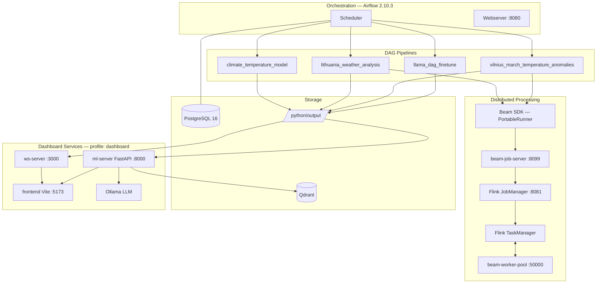
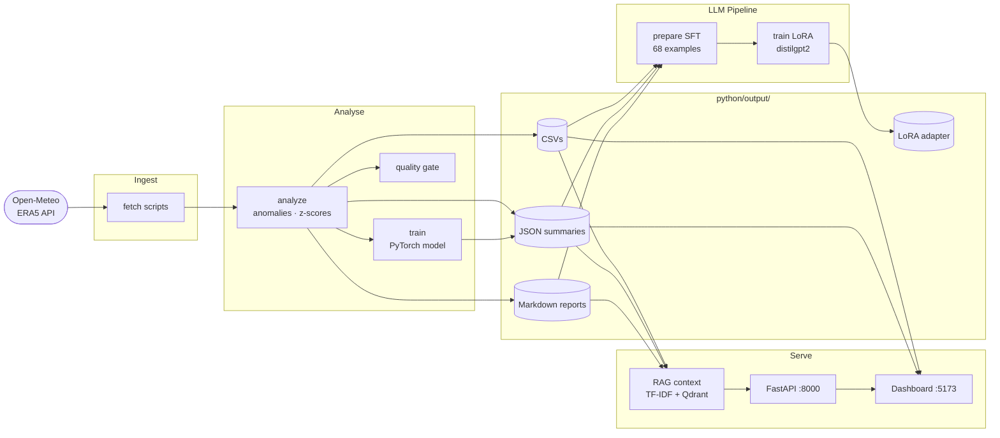

# Lithuania Climate Anomaly Dashboard

End-to-end MLOps workflow for ERA5 climate analytics with Airflow orchestration,
PyTorch training, Qdrant-backed retrieval, and a live dashboard.

## Prerequisites

- Python 3.11+ managed by [uv](https://docs.astral.sh/uv/)
- Node.js 18+ and npm
- Docker and Docker Compose (for the full stack)

## Stack

| Layer | Technology |
|---|---|
| Orchestration | Apache Airflow 2.10.3 + PostgreSQL 16 |
| Data | Open-Meteo ERA5 reanalysis |
| Distributed processing | Apache Beam 2.71.0 · PortableRunner → Flink 1.20.1 |
| Local processing | Python 3.11, pandas, numpy |
| Modeling | PyTorch, MLflow-skinny |
| LLM fine-tuning | distilgpt2 + LoRA (PEFT), 68 SFT examples |
| Retrieval | Qdrant local store + lightweight TF-IDF |
| Frontend | Vite, vanilla JS, Chart.js |
| Live updates | Node 20 WebSocket server + periodic export |
| CI | GitHub Actions (build + stack-smoke) |


## Architecture



## Data Flow



## DAGs

Current DAG IDs:

- climate_temperature_model
- lithuania_weather_analysis
- vilnius_march_temperature_anomalies
- llama_dag_finetune (manual)

Each DAG ends with refresh_rag_context to rebuild retrieval context from latest
pipeline artifacts.

## Quick Start

### 1. Install dependencies

```bash
cd ml
uv sync          # Python deps
npm install       # JS deps
```

### 2. Validate tests

```bash
uv run python -m pytest python/tests -q
```

Current verified status: 30 passed.

### 3. Export dashboard data

```bash
uv run python python/export_frontend_data.py
```

This reads pipeline outputs under python/output/ and writes src/data/dashboard.json.

### 4. Start dashboard UI

```bash
npm run dev
```

Open http://localhost:5173. You will see:

- KPI cards for current Lithuanian temperature and precipitation anomalies
- A 30-year Vilnius March anomaly bar chart
- City-level z-score comparisons
- ML model regression metrics
- Vector RAG Briefings assembled from pipeline artifacts
- An "Ask the Pipeline" form for live retrieval queries

## Docker Stack

The fastest way to run everything (Airflow + dashboard + RAG API):

Use `docker compose` below. On systems with Docker Compose v2 installed as a
Docker plugin, `docker-compose` may not exist.

```bash
docker compose --project-directory . -f airflow/docker-compose.yml -f docker-compose.full.yml up -d --build
```

First-time setup:

```bash
docker compose --project-directory . -f airflow/docker-compose.yml -f docker-compose.full.yml up airflow-init
docker compose --project-directory . -f airflow/docker-compose.yml -f docker-compose.full.yml up -d --build
```

Repeat runs after the admin user already exists:

```bash
docker compose --project-directory . -f airflow/docker-compose.yml -f docker-compose.full.yml up -d --build
```

If you only need to sync the Airflow schema without re-running user creation:

```bash
docker compose --project-directory . -f airflow/docker-compose.yml -f docker-compose.full.yml run --rm --entrypoint /bin/bash airflow-init -lc "airflow db migrate"
```

To use prebuilt GHCR images (no local image build), pull and run:

```bash
export GHCR_OWNER=andrius
echo <github_pat> | docker login ghcr.io -u YOUR_GITHUB_USERNAME --password-stdin
docker compose --project-directory . -f airflow/docker-compose.yml -f docker-compose.full.yml pull
docker compose --project-directory . -f airflow/docker-compose.yml -f docker-compose.full.yml up -d
```

The GHCR images are intended to stay private. Authenticate before pulling them
locally. If you ever change a GHCR package to public in GitHub, GitHub does not
allow changing that package back to private.

Once running, trigger DAGs from Airflow UI at http://localhost:8080 (admin / admin).
The dashboard at http://localhost:5173 updates automatically via WebSocket.

## Airflow (Local Standalone)

Run in its own terminal:

```bash
cd ml/airflow

export AIRFLOW_HOME="$PWD/.airflow"
export AIRFLOW__CORE__DAGS_FOLDER="$PWD/dags"
export AIRFLOW__CORE__LOAD_EXAMPLES=False
export ML_PROJECT_ROOT="$PWD/.."
export TRAIN_PYTHON_BIN="$PWD/../.venv/bin/python"

env -u VIRTUAL_ENV uv run airflow standalone
```

Open http://localhost:8080 (admin / check .airflow/standalone_admin_password.txt).

Trigger a DAG manually:

```bash
cd ml/airflow
env -u VIRTUAL_ENV \
  AIRFLOW_HOME="$PWD/.airflow" \
  AIRFLOW__CORE__DAGS_FOLDER="$PWD/dags" \
  AIRFLOW__CORE__LOAD_EXAMPLES=False \
  ML_PROJECT_ROOT="$PWD/.." \
  TRAIN_PYTHON_BIN="$PWD/../.venv/bin/python" \
  ./.venv/bin/airflow dags trigger lithuania_weather_analysis
```

## Live RAG Query API

The dashboard "Ask the Pipeline" form sends questions to a FastAPI endpoint.
Start the API server in a separate terminal:

```bash
cd ml
uv run uvicorn --app-dir python serve:app --host 127.0.0.1 --port 8000
```

The --app-dir python flag is required so uvicorn can find serve.py.
Without it you get: Could not import module "serve".

Test it:

```bash
curl "http://127.0.0.1:8000/rag/query?q=Is+Lithuania+warmer+than+usual%3F"
```

Example response:

```json
{
  "question": "Is Lithuania warmer than usual?",
  "answer": "Based on retrieved DAG outputs, Lithuania year-to-date weather shows a temperature anomaly of -3.46 C with z-score -1.47.",
  "sources": [{"title": "weather_summary narrative 1", "source": "weather/weather_summary.md", "score": 0.41}]
}
```

Note: the API returns meaningful answers only after DAGs have run and produced
artifacts under python/output/. Before that, you get "No relevant pipeline
artifacts were available."

### Local Llama for RAG (Optional)

The full docker stack now includes an `ollama` service and `ml-server` is
configured to use it for answer synthesis by default.

Start or refresh the relevant services:

```bash
docker compose --project-directory . -f airflow/docker-compose.yml -f docker-compose.full.yml up -d --build ml-server frontend ollama
```

Pull a local model once:

```bash
docker compose --project-directory . -f airflow/docker-compose.yml -f docker-compose.full.yml exec ollama ollama pull llama3.1:8b
```

Override model/provider if needed:

```bash
RAG_LLM_PROVIDER=ollama OLLAMA_MODEL=llama3.1:8b \
docker compose --project-directory . -f airflow/docker-compose.yml -f docker-compose.full.yml up -d ml-server ollama
```

## Beam Multi-Node Test

The weather DAG already includes a Beam task (`beam_regional_analysis`).
You can run it with different runners without code changes.

Default behavior is local:

```bash
BEAM_RUNNER=DirectRunner
```

For distributed tests, pass runner-specific args via `BEAM_PIPELINE_ARGS`.
Example for Flink runner:

```bash
cd ml
docker compose --project-directory . -f airflow/docker-compose.yml -f docker-compose.full.yml up -d flink-jobmanager flink-taskmanager

BEAM_RUNNER=FlinkRunner \
BEAM_PIPELINE_ARGS="--flink_master=flink-jobmanager:8081 --parallelism=4 --environment_type=LOOPBACK" \
BEAM_ENVIRONMENT_TYPE=LOOPBACK \
docker compose --project-directory . -f airflow/docker-compose.yml -f docker-compose.full.yml up -d airflow-scheduler airflow-webserver

# Kubernetes / Docker environment modes
# For Kubernetes native Beam execution (when you have an in-cluster Flink and Beam portable env):
BEAM_RUNNER=FlinkRunner \
BEAM_ENVIRONMENT_TYPE=KUBERNETES \
BEAM_PIPELINE_ARGS="--flink_master=http://<flink-jobmanager-host>:8081 --parallelism=4 --no-fetch-missing-cities" \
docker compose --project-directory . -f airflow/docker-compose.yml -f docker-compose.full.yml up -d airflow-scheduler airflow-webserver
```

The DAG task will execute:

```bash
python beam_analysis.py --runner "$BEAM_RUNNER" ... $BEAM_PIPELINE_ARGS
```

You can also run the Beam job directly:

```bash
cd ml
python python/beam_analysis.py \
  --input python/output/weather/raw_daily_weather.csv \
  --output-dir python/output/beam \
  --runner FlinkRunner \
  --flink_master localhost:8081 \
  --parallelism 4 \
  --environment_type LOOPBACK
```

## Train Llama On DAG Artifacts (LoRA)

This project now includes a manual Airflow DAG (`llama_dag_finetune`) and scripts to:

1. Build supervised fine-tuning data from pipeline outputs.
2. Train a LoRA adapter on top of a llama-compatible base model.

The Airflow image installs the LoRA training dependencies automatically when rebuilt.

Compatibility note:

- Airflow runtime is pinned to `torch==2.2.2`.
- LoRA stack is pinned in `python/requirements-llm-train.txt` to versions compatible with torch 2.2.x.
- If you install newer `transformers/accelerate/peft`, `train_lora_adapter` can fail at import time.

If `llama_dag_finetune` fails with dependency/import errors, rebuild and restart Airflow services:

```bash
cd ml
docker compose --project-directory . -f airflow/docker-compose.yml -f docker-compose.full.yml build airflow-init airflow-webserver airflow-scheduler
docker compose --project-directory . -f airflow/docker-compose.yml -f docker-compose.full.yml up -d airflow-webserver airflow-scheduler
```

Then clear failed task state and re-run:

```bash
cd ml
docker compose --project-directory . -f airflow/docker-compose.yml -f docker-compose.full.yml exec airflow-webserver \
  airflow tasks clear llama_dag_finetune train_lora_adapter --yes
```

For local non-Airflow runs, install training dependencies with:

```bash
cd ml
uv pip install -r python/requirements-llm-train.txt
```

Manual run without Airflow:

```bash
cd ml
uv run python python/llama_prepare_sft.py --output-dir python/output
uv run python python/llama_train_lora.py \
  --train-jsonl python/output/llm/sft_train.jsonl \
  --eval-jsonl python/output/llm/sft_eval.jsonl \
  --base-model distilgpt2 \
  --max-length 256 \
  --output-dir python/output/llm/lora-adapter
```

Or trigger in Airflow UI:

- DAG: `llama_dag_finetune`
- Tasks: `prepare_sft_dataset` -> `train_lora_adapter`
- Default base model: `distilgpt2` (82M params, trains in ~1-2 min on CPU)
- Override with env var `LLAMA_BASE_MODEL` for a larger model (e.g. `TinyLlama/TinyLlama-1.1B-Chat-v1.0`).

Expected output path after a successful run:

- `python/output/llm/lora-adapter/`

## Project Layout

```text
ml/
  airflow/dags/
    train_dag.py
    weather_lithuania_dag.py
    vilnius_march_temperature_dag.py
  python/
    model.py
    metrics.py
    climate_data.py
    climate_train.py
    climate_evaluate.py
    weather_common.py
    weather_fetch.py
    weather_analyze.py
    weather_plot.py
    weather_quality_gate.py
    vilnius_march_fetch.py
    vilnius_march_analyze.py
    vilnius_march_plot.py
    vilnius_march_quality_gate.py
    rag_pipeline.py
    export_frontend_data.py
    serve.py
    quality_gate.py
    plot.py
    diagnostics.py
    run_all.py
    tests/
  server/
    dashboard-ws.js
  src/
    main.js
    styles.css
    data/dashboard.json
  docker/
    airflow/Dockerfile
    frontend/Dockerfile
    frontend/nginx.conf
    ml-pipeline/Dockerfile
    ws-server/Dockerfile
  docker-compose.full.yml
  docker-stack.yml
  pyproject.toml
  vite.config.js
```

## CI

GitHub Actions workflows:

- .github/workflows/ci.yml
  - npm ci, npm run build, format check
  - uv sync, dry-run train check, pytest
  - full Docker stack smoke test (build + airflow-init + endpoint checks)
- .github/workflows/docker-images.yml
  - builds and pushes images to ghcr.io on push to main/master and manual dispatch
  - images: ml-airflow-custom, ml-ws-server, ml-frontend, ml-ml-pipeline
  - images are expected to remain private in GHCR; local pulls require auth

## Notes

- pyproject.toml plus uv.lock are the dependency source of truth.
- python/requirements.txt is exported for compatibility workflows.
- python/requirements-airflow-runtime.txt remains curated for airflow image needs.
- ERA5 is reanalysis data on a 0.25 degree grid. For publication-quality
  climatology, cross-validate against Lithuanian Hydrometeorological Service
  station records.
